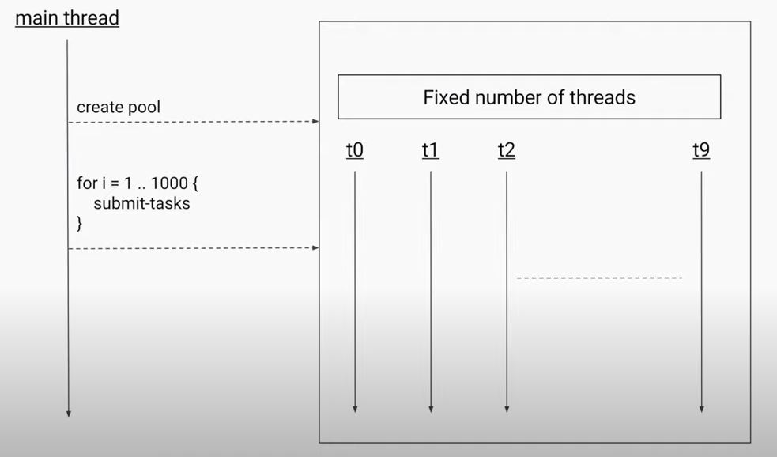
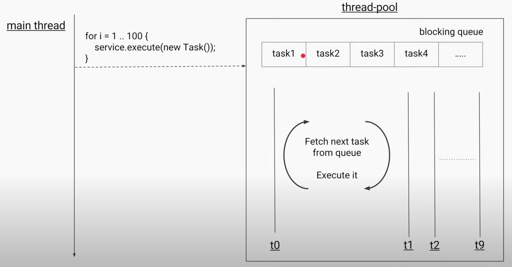
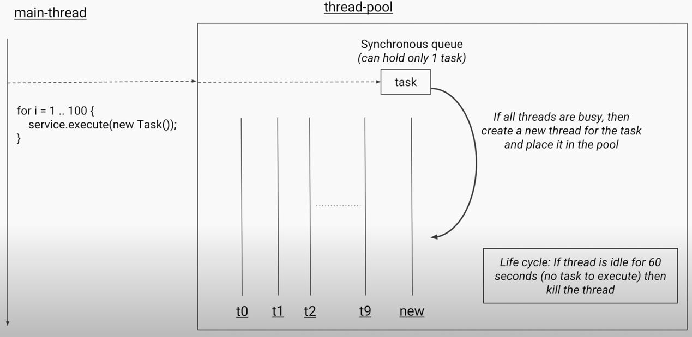
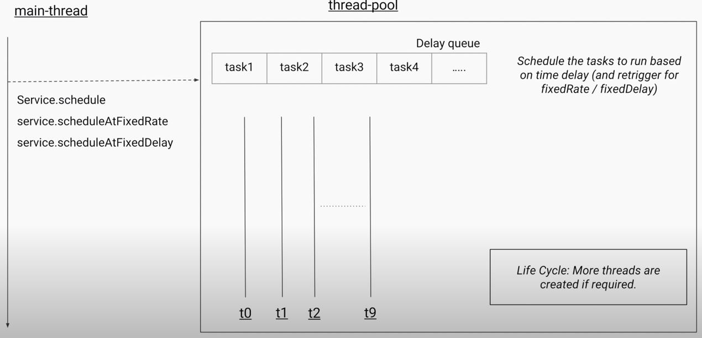
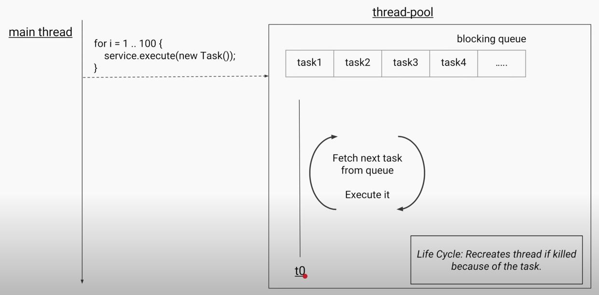
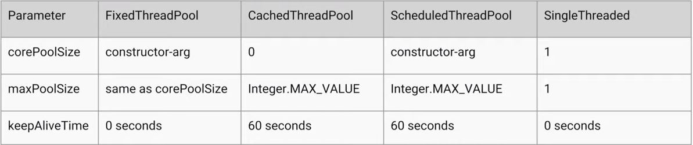
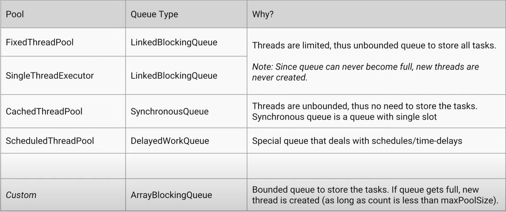
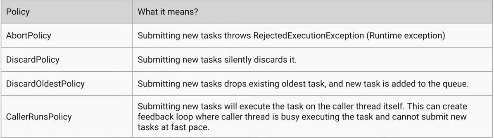

### Executor Service
One Java thread corresponds to one OS thread. Creating thread is an expensive operation. Rather, create fixed number of threads (thread pool) and submit tasks to the thread pool.

Following is the way to create thread pool with 10 fixed threads:
```java
  ExecutorService threadPool = Executors.newFixedThreadPool(10);
  // newFixedThreadPool method in Executors class
  public static ExecutorService newFixedThreadPool(int nThreads) {
      return new ThreadPoolExecutor(nThreads, nThreads,
                                    0L, TimeUnit.MILLISECONDS,
                                    new LinkedBlockingQueue<Runnable>());
  }
  // ThreadPoolExecutor constructor
  public ThreadPoolExecutor(int corePoolSize, // Minimum/base size of the pool
                            int maximumPoolSize, // Maximum size of the pool
                            long keepAliveTime, // Time to keep an idle thread alive (after which it is killed)
                            TimeUnit unit,
                            BlockingQueue<Runnable> workQueue, // Queue to store the tasks from which threads fetch them
                            ThreadFactory threadFactory, // The factory to use when the executor creates a new thread
                            RejectedExecutionHandler handler // the handler to use when execution is blocked because the thread bounds and queue capacities are reached
                            ) {
      this(corePoolSize, maximumPoolSize, keepAliveTime, unit, workQueue,
           Executors.defaultThreadFactory(), defaultHandler);
  }
```
#### Types of Thread Pool
1. Fixed Thread Pool
1. Cached Thread Pool
1. Scheduled Thread Pool
1. Single Threaded Executor
##### Fixed Thread Pool
Fixed thread pool internally uses blocking queue to store submitted tasks. Each thread in the pool fetch task from the queue and execute it. All threads in the pool may attempt to fetch task from the queue at the same time, so the queue should be able to handle concurrent operations (thread-safe). Thread pool uses blocking queue.

##### Cached Thread Pool
It has the synchronous queue which can hold only 1 task. When the task is added to the queue, it looks for any free thread, or create a new thread in the pool to execute the task.
If the thread in the pool is idle for 60 seconds, then it will be removed from the pool.

##### Scheduled Thread Pool
Specifically for scheduling the tasks to run after a delay.

##### Single Threaded Executor
Size of the pool is only one. It is used to ensure tasks are run in the order in which submitted. Since one thread executes all tasks, it ensures all tasks runs sequentially.

#### Thread Pool Parameters

Find below Work Queues:

Find below Rejection Execution Handlers:

##### Life cycle methods
```java
    // Initiate shutdown
    threadPool.shutdown();

    // will throw RejectionExecutionException
    //threadPool.execute(task);

    // Will return true, since shutdown has begun
    threadPool.isShutdown();

    // Will return true if all tasks are completed including queued ones
    threadPool.isTerminated();

    // block until all tasks are completed ot if timeout occurs
    threadPool.awaitTermination(10, SECONDS);
    
    // Will initiate shutdown and return all queued tasks
    final List<Runnable> runnables = threadPool.shutdownNow();
```