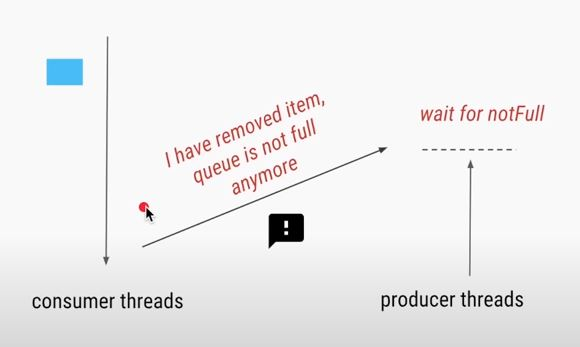

#### Producer Consumer

- One or more producers create object in the storage
- One or more consumers get object from the storage
- If there are no item in storage, consumer have to wait until another item added to the storage
- Producer wait for item to be removed from the storage if storage is full
- Find below high level design:
  
This can be implemented in 3 different ways:
- Using BlockingQueue
  - BlockingQueue supports operations that wait for the queue to become non-empty when retrieving an element, and wait for space to become available in the queue when storing an element
- Using lock or wait/notify
  - Need to write own implementation of blocking queue using lock or wait/notify
  - Access to put & take method requires lock to protect simultaneous access
    
  - Put operation - if the queue is full wait until an item removed from the queue
  - Take operation - if queue is empty wait until an item added to the queue
  - After adding an item to the queue in **put** operation, notify the threads which are waiting due to queue isempty
    
  - After removing an item to the queue in **take** operation, notify the threads which are waiting due to queue is full
    
  - Look at below scenario:
    
    - 2 consumer threads waiting for the queue to become nonempty
    - Producer thread added an item in the queue
    - Producer thread notifies all consumer threads which are waiting for the queue to become nonempty
    - Both consumer threads comes out of waiting state and move to runnable state
    - One of the consumer thread acquires the lock and process the item in the queue
    - Queue becomes empty now
    - The other thread acquires the lock now try to get the message from the queue and there are no messages in the queue
    - Same scenario is applicable for multiple producer threads waiting for the queue to become not full
    - Queue size needs to be checked again to avoid this issue, so use **while** to check queue size in put & take instead of **if**